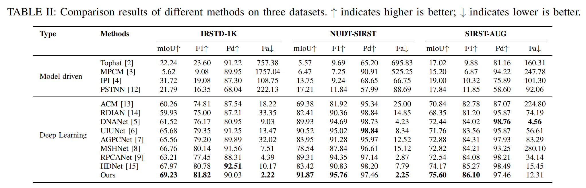

# DCNet
**[]** “DCNet: Iterative Dual-Task Decoupling for Infared Small Target Detection".

## Abstract
Infrared small target detection is crucial in military reconnaissance and other fields, but its small size and the high coupling with complex backgrounds make detection difficult. Existing methods mainly focus on target feature learning, neglecting the key role of background modeling in decoupling. To address this, this paper proposes a dual-task collaborative optimization framework, MSCoNet, which decouples the task into background estimation and target segmentation, and gradually approaches the true distribution of both through multi-stage iterative optimization. Since complex infrared backgrounds commonly have directional texture features, a direction-aware module (DBEM) is designed in background estimation, which uses directional convolution (DDC) to capture directional textures such as clouds, and combines second-order attention to enhance low-contrast modeling. In target segmentation, we construct a background suppression gated unit (BSGU), which dynamically removes background noise through a gating mechanism and channel-level factors. In each stage, the original image is reconstructed by combining the preliminary background and the target, and the accurate background estimation is further calculated based on physical constraints. The updated information is passed to the next stage for iterative optimization. Experiments show that MSCoNet significantly outperforms mainstream methods on three public datasets.

## Network Architecture


## Requirements
- **Python 3.8**
- **Windows10, Ubuntu18.04 or higher**
- **NVDIA GeForce RTX 4090**
- **pytorch 1.8.0 or higher**
- **More details from requirements.txt** 

## Datasets

**We used NUDT-SIRST, IRSTD-1K and sirst-aug for both training and test. Our dataset can be downloaded from this link: （https://pan.baidu.com/s/1_lHOUUr9PW-YJIKCf0Q0XA?pwd=vbuq     Extraction Code: vbuq）.**
 
**Please first download these datasets and place the 3 datasets to the folder `./datasets/`. **

* **Our project has the following structure:**
```
├──./datasets/
│    ├── NUDT-SIRST/ & IRSTD-1k/ & sirst_aug/
│    │    ├── trainval
│    │    │    ├── images
│    │    │    │    ├── 000002.png
│    │    │    │    ├── 000004.png
│    │    │    │    ├── ...
│    │    │    ├── masks
│    │    │    │    ├── 000002.png
│    │    │    │    ├── 000004.png
│    │    │    │    ├── ...
│    │    ├── test
│    │    │    ├── images
│    │    │    │    ├── 000001.png
│    │    │    │    ├── 000003.png
│    │    │    │    ├── ...
│    │    │    ├── masks
│    │    │    │    ├── 000001.png
│    │    │    │    ├── 000003.png
│    │    │    │    ├── ...
```
<br>

## Commands for Training
* **Run** `run_0.py` **to perform network training:**
```bash
$ python run_0.py
```

## Commands for Evaluate your own results
* **Run** `t_models.py` **to generate file of the format .mat and .png:**
```bash
$ python t_models.py
```
* **The file generated will be saved to** `./results/` **that has the following structure**:
```
├──./results/
│    ├── [dataset_name]
│    │   ├── img
│    │   │    ├── 000000.png
│    │   │    ├── 000001.png
│    │   │    ├── ...
│    │   ├── mat
│    │   │    ├── 000000.mat
│    │   │    ├── 000001.mat
│    │   │    ├── ...
```
* **Run** `cal_from_mask.py` **for direct evaluation**:
```bash
$ python cal_from_mask.py
```

## Result

**The weights trained on the three datasets are in the 'Weight' folder：**
```
├── ./Weight/
│    ├── IRSTD-1K/
│    │   ├── best.pkl
│    │   ├── log.txt
│    ├── SIRST-AUG/
│    │   ├── best.pkl
│    │   ├── log.txt
│    ├── SIRST-NUDT/
│    │   ├── best.pkl
│    │   ├── log.txt

```


## Citation
```
```
