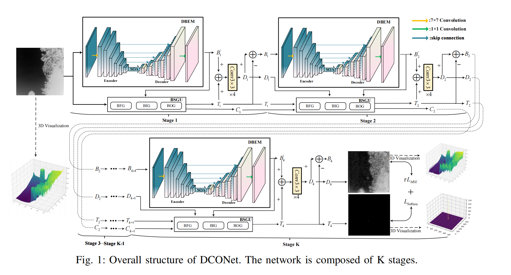

# DCONet
**[IEEE GRSL]** “DCONet: Dual-task Collaborative Optimization Network for Infrared Small Target Detection".

## Abstract
Infrared small target detection is crucial in military reconnaissance, remote sensing, and so on. However, due to its small size and the high coupling with complex backgrounds, the present methods still face challenges in precise detection. They predominantly focus on target feature learning, while neglecting the critical role of background modeling for small target decoupling. To this end, we propose a dual-task collaborative optimization network (DCONet), which decouples the task into background estimation and target segmentation using a multi-stage iterative optimization strategy. First, considering significant directional distribution characteristics in infrared backgrounds, we propose a Direction-Aware Background Estimation Module (DBEM) to capture directional features, such as clouds and trees, thereby generating an initial background estimation. Second, we propose a Background Suppression Gating Unit (BSGU), which employing a gating mechanism and a channel-level adjustment factor to dynamically suppress background noise based on the preliminary background estimation, thereby generating the target segmentation result. Finally, the estimated background, target segmentation, and the reconstructed original image based on them are propagated to the next stage for further iterative optimization. Experimental results show that DCONet performs better than existing methods across three public datasets. The source code is available at: https://github.com/tustAilab/DCONet.

## Network Architecture



## Requirements
- **Python 3.8**
- **Windows10, Ubuntu18.04 or higher**
- **NVDIA GeForce RTX 4090**
- **pytorch 1.8.0 or higher**
- **More details from requirements.txt** 

## Datasets

**We used NUDT-SIRST, IRSTD-1K and sirst-aug for both training and test. Our dataset can be downloaded from this link: （https://pan.baidu.com/s/1_lHOUUr9PW-YJIKCf0Q0XA?pwd=vbuq     Extraction Code: vbuq）.**
 
**Please first download these datasets and place the 3 datasets to the folder `./datasets/`. **

* **Our project has the following structure:**
```
├──./datasets/
│    ├── NUDT-SIRST/ & IRSTD-1k/ & sirst_aug/
│    │    ├── trainval
│    │    │    ├── images
│    │    │    │    ├── 000002.png
│    │    │    │    ├── 000004.png
│    │    │    │    ├── ...
│    │    │    ├── masks
│    │    │    │    ├── 000002.png
│    │    │    │    ├── 000004.png
│    │    │    │    ├── ...
│    │    ├── test
│    │    │    ├── images
│    │    │    │    ├── 000001.png
│    │    │    │    ├── 000003.png
│    │    │    │    ├── ...
│    │    │    ├── masks
│    │    │    │    ├── 000001.png
│    │    │    │    ├── 000003.png
│    │    │    │    ├── ...
```
<br>

## Commands for Training
* **Run** `run_0.py` **to perform network training:**
```bash
$ python run_0.py
```

## Commands for Evaluate your own results
* **Run** `t_models.py` **to generate file of the format .mat and .png:**
```bash
$ python t_models.py
```
* **The file generated will be saved to** `./results/` **that has the following structure**:
```
├──./results/
│    ├── [dataset_name]
│    │   ├── img
│    │   │    ├── 000000.png
│    │   │    ├── 000001.png
│    │   │    ├── ...
│    │   ├── mat
│    │   │    ├── 000000.mat
│    │   │    ├── 000001.mat
│    │   │    ├── ...
```
* **Run** `cal_from_mask.py` **for direct evaluation**:
```bash
$ python cal_from_mask.py
```

## Result

**The weights trained on the three datasets are in the 'Weight' folder：**
```
├── ./Weight/
│    ├── IRSTD-1K/
│    │   ├── best.pkl
│    │   ├── log.txt
│    ├── SIRST-AUG/
│    │   ├── best.pkl
│    │   ├── log.txt
│    ├── SIRST-NUDT/
│    │   ├── best.pkl
│    │   ├── log.txt

```


## Citation
```
```
